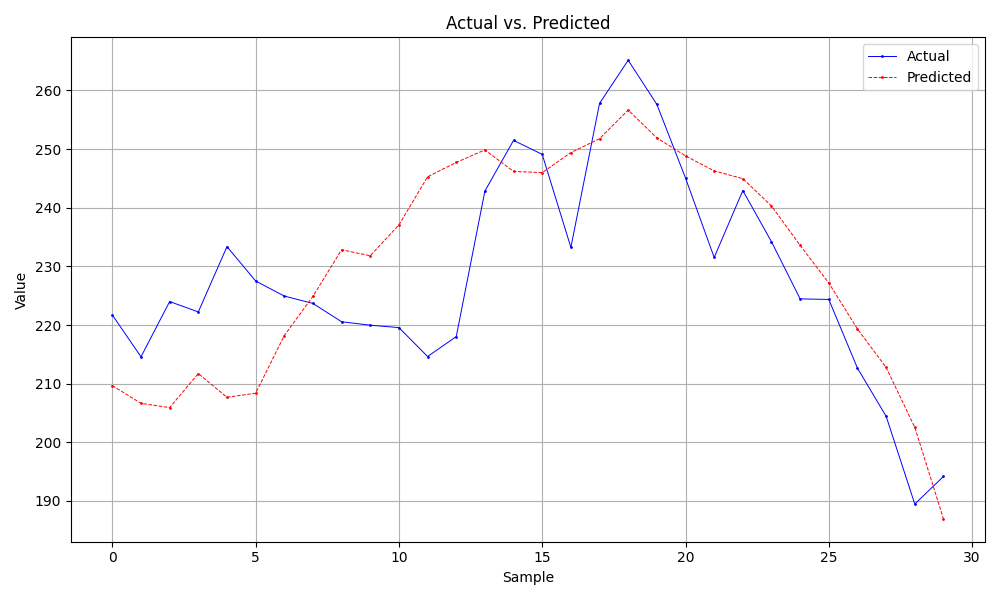

# Stock Price Predictions

## Description
This project tackles the age old problem of trying to beat the stock market. Instead of traditional methods of manual analysis of stock metrics, This project incorporates AI by using a LSTM neural network to predict stock closing prices

## Installation and Usage
### Installation
Run `pip install -r requirements.txt` to ensure all packages are downloaded

### Basic Usage
Run `python main.py` to run the program. However, much more can and should be done to use the project to its full potential

### Project Navigation
All outputs such as graphs, models, and trials are outputted into folders/files. They are structured as so...
```
data
|___Ticker Name
|   |___Trial #
|   |       output graph
|   |       output model
|   |       notes about model
```

Ticker Name: Name of Stock (ex. AAPL)  
Trial #: As different models are tested, each is organized under the Stock it was run under  
Output Graph: This is the graph that graphs predictions vs actual stock closing prices to help visualize results  
Output Model: This is the LSTM model in case it needs to be updated/used again later  
Notes.txt: This contains notes about the model. For example, currently set to show date, val loss, sequence length, n days, along with basic model layer summary  

For better understanding, here is what an actual one may look like
```
data
|___AAPL
|   |___1
|   |   graph.png
|   |   model.keras
|   |   notes.txt
|   |___2
|   |   graph.png
|   |   model.keras
|   |   notes.txt
|___GOOG
|   |___1
|   |   graph.png
|   |   model.keras
|   |   notes.txt
```

### Parameters
This project makes use of global variables to help add parameters to the program. These include choosing which stocks to look at and specific model training parameters like epochs, batch size, etc. See code files for comments next to global variables to see what adjusting each does. __Please make use of these global variables. They allow for fine tuning and huge amounts of adjustments to the code based on what you need out of the program__